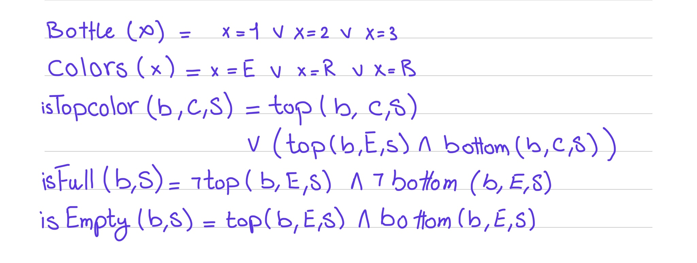
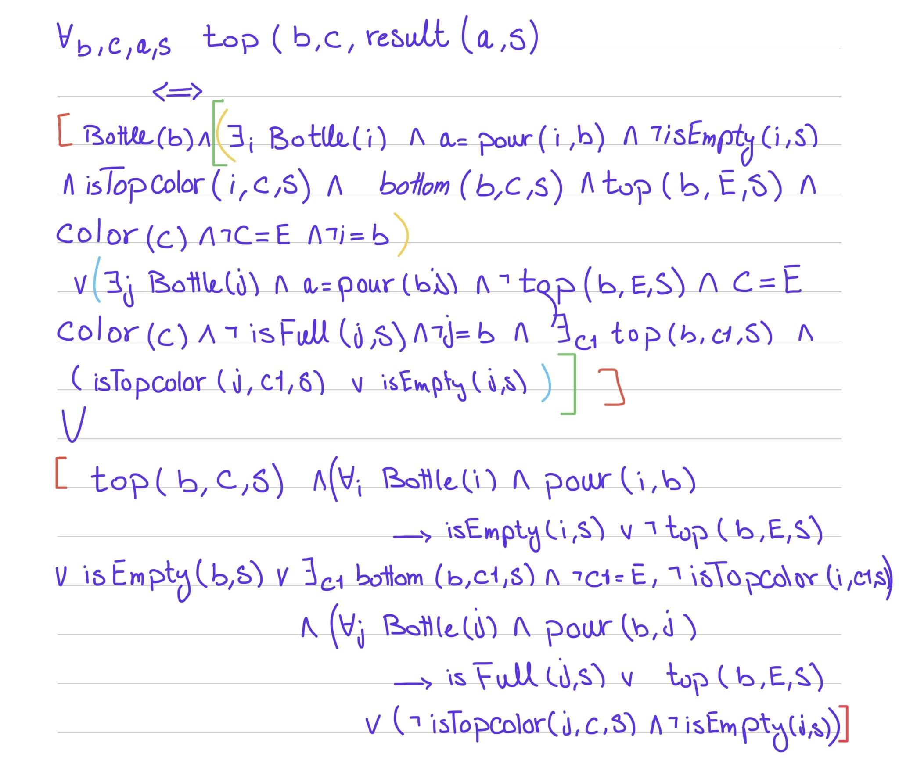
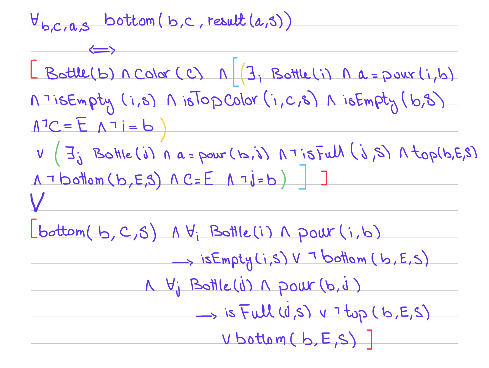

## Water Sort Puzzle Solver using Knowledge agent in prolog 

### Introduction:
In this Project we are aiming to solve the water sort puzzle which we already solved using search agents in java. So, in this project we are going to solve the same puzzle using knowledge agent in prolog. Making use of successor state axioms to represent the fluents which are the states of the puzzle that gets affected with the actions.

### Problem Solution Approach:

#### 1. Actions:
The puzzle has only one action which is to pour the water from one bottle to another. So, we have only one action which is pour with the constraint that we only pour one layer at a time. 

#### 2. Predicates and Fluents:
    
1. Bottle: This predicate is used to represent the bottles in the puzzle. We have 3 bottles in the puzzle.
2. Color: This predicate is used to represent the colors of the water in the puzzle. We have 2 colors in the puzzle which are red and blue colors.

Note: We are representing the empty as a color in the puzzle so we have a third color in the code which is empty "e".
    
- Fluents:
    Each bottle has 2 layers only to fill so we have 2 fluents to represent the layers of the bottle.
    1. top(Bottle, Color,S): This fluent is used to represent the top layer of the bottle with its color in the situation S.
    2. bottom(Bottle, Color,S): This fluent is used to represent the bottom layer of the bottle with its color in the situation S.

#### 3. Successor State Axioms:

Successor state axioms the answer to the question if we fluent is f(_,S) true what can make f(_,result(a,s)) true, what the action can be and what is the current state of the puzzle should be to make the fluent true in the next state.

- top fluent : we explore first the effect part then the frame part. which we or together to get the final result.

1. Effect: The top layer of the bottle b is color c in the result of action a in the situation result(a,s) if and only if 
    - the top layer of the bottle b is not color c in the situation s and (the OR of statement 1 and 2)
        - Statement 1: there exists another bottle b1 , the action a is pouring from b1 to b, b1 is not empty, the topmost **(either top layer or top is empty and bottom is the topmost layer)** layer of b1 is color c, the bottom layer of b is not empty , the top layer of b is empty , the color we are pouring is not representing the empty color and b and b1 are not the same bottle.
        
        - Statement 2: there exists another bottle b1 , the action a is pouring from b to b1, the color is representing empty color, the top layer of b is not empty , b1 is not full and b and b1 are not the same bottle.

2. Frame: The top layer of the bottle b is color c in the result of action a in the situation result(a,s) if and only if 
    - the top layer of the bottle b is color c in the situation s and (the OR of statement 1 and 2 and 3)
        - Statement 1: for all the bottles b1, if the action a is pouring from b to b1 then the action fails or does not affect the top layer of the bottle b so either b1 is full or the top layer of b is empty.
        
        - Statement 2: for all the bottles b1, if the action a is pouring from b1 to b then the action fails or does not affect the top layer of the bottle b so either b1 is empty or the top layer of b is not empty or the bottom layer of b is empty.
        
        - Statement 3: for all the bottles b1 and bottles b2, if the action a is pouring then b1 and b2 are both not equal to b so we do not have any effect on b.

- bottom fluent : we explore first the effect part then the frame part. which we or together to get the final result.

1. Effect: The bottom layer of the bottle b is color c in the result of action a in the situation result(a,s) if and only if 
    - the bottom layer of the bottle b is not color c in the situation s and (the OR of statement 1 and 2)
        - Statement 1: there exists another bottle b1 , the action a is pouring from b1 to b, b1 is not empty, the topmost **(either top layer or top is empty and bottom is the topmost layer)** layer of b1 is color c, bottle b is empty , the color we are pouring is not representing the empty color and b and b1 are not the same bottle.
        
        - Statement 2: there exists another bottle b1 , the action a is pouring from b to b1, the color is representing empty color, the top layer of b is not empty , b1 is not full and b and b1 are not the same bottle.

2. Frame: The bottom layer of the bottle b is color c in the result of action a in the situation result(a,s) if and only if 
    - the bottom layer of the bottle b is color c in the situation s and (the OR of statement 1 and 2 and 3)
        - Statement 1: for all the bottles b1, if the action a is pouring from b to b1 then the action fails or does not affect the bottom layer of the bottle b so either b1 is full or the top layer of b is not empty or the bottom layer of b is empty.
        
        - Statement 2: for all the bottles b1, if the action a is pouring from b1 to b then the action fails or does not affect the bottom layer of the bottle b so either b1 is empty or the bottom layer of b is empty or the bottom layer of b is not empty.
        
        - Statement 3: for all the bottles b1 and bottles b2, if the action a is pouring then b1 and b2 are both not equal to b so we do not have any effect on b.

- FOL Representation:-
- Helper Axioms

- Top Fluent

- Bottom Fluent

#### 4. Examples and run time:

- add later..................