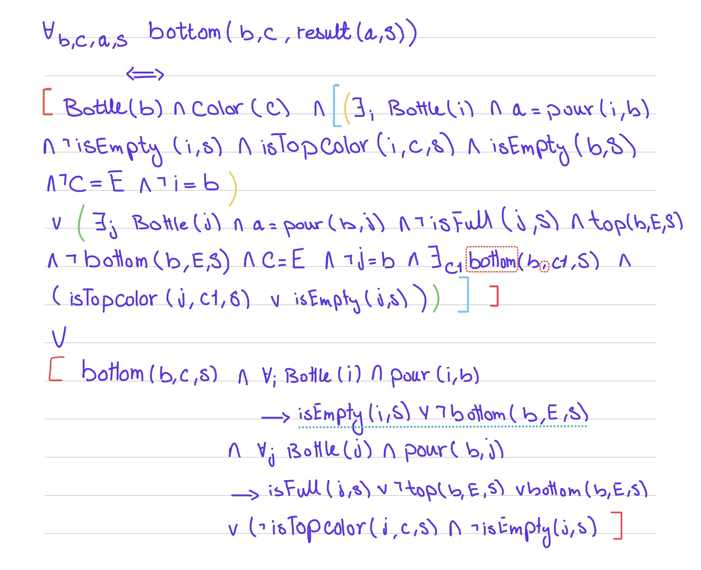

## Water Sort Puzzle Solver using Knowledge based agent in prolog 

### Introduction:
In this Project we are aiming to solve the water sort puzzle which we already solved using search agents in java. So, in this project we are going to solve the same puzzle using knowledge agent in prolog. Making use of successor state axioms to represent the fluents which are the states of the puzzle that gets affected with the actions.

### Problem Solution Approach:

#### 1. Actions:
The puzzle has only one action which is to pour the water from one bottle to another. So, we have only one action which is pour with the constraint that we only pour one layer at a time. 

#### 2. Predicates and Fluents:
    
1. Bottle: This predicate is used to represent the bottles in the puzzle. We have 3 bottles in the puzzle.
2. Color: This predicate is used to represent the colors of the water in the puzzle. We have 2 colors in the puzzle which are red and blue colors.

Note: We are representing the empty as a color in the puzzle so we have a third color in the code which is empty "e".
    
- Fluents:
    Each bottle has 2 layers only to fill so we have 2 fluents to represent the layers of the bottle.
    1. top(Bottle, Color,S): This fluent is used to represent the top layer of the bottle with its color in the situation S.
    2. bottom(Bottle, Color,S): This fluent is used to represent the bottom layer of the bottle with its color in the situation S.

#### 3. Successor State Axioms:

Successor state axioms the answer to the question if we fluent is f(_,S) true what can make f(_,result(a,s)) true, what the action can be and what is the current state of the puzzle should be to make the fluent true in the next state.

- top fluent : we explore first the effect part then the frame part. which we or together to get the final result.

1. Effect: The top layer of the bottle b is color c in the result of action a in the situation result(a,s) if and only if 
    - the top layer of the bottle b is not color c in the situation s and (the OR of statement 1 and 2)
        - Statement 1: there exists another bottle b1 , the action a is pouring from b1 to b, b1 is not empty, the topmost **(either top layer or top is empty and bottom is the topmost layer)** layer of b1 is color c, the bottom layer of b is the same color c, the top layer of b is empty , the color we are pouring is not representing the empty color and b and b1 are not the same bottle.
        
        - Statement 2: there exists another bottle b1 , the action a is pouring from b to b1, the color is representing empty color, the top layer of b is not empty , b1 is not full , b and b1 are not the same bottle, and the color of at the top of bottle b is the same top layer color of b1 or b1 is empty.


2. Frame: The top layer of the bottle b is color c in the result of action a in the situation result(a,s) if and only if 
    - the top layer of the bottle b is color c in the situation s and (the OR of statement 1 and 2 and 3)
        - Statement 1: for all the bottles b1, if the action a is pouring from b to b1 then the action fails or does not affect the top layer of the bottle b so either b1 is full or the top layer of b is empty or b1 top layer is not c and it's not empty too.
        
        - Statement 2: for all the bottles b1, if the action a is pouring from b1 to b then the action fails or does not affect the top layer of the bottle b so either b1 is empty or the top layer of b is not empty or the bottom layer of b is empty or the top layer of b and b1 is not the same.
        
        - Statement 3: for all the bottles b1 and bottles b2, if the action a is pouring then b1 and b2 are both not equal to b so we do not have any effect on b.

- bottom fluent : we explore first the effect part then the frame part. which we or together to get the final result.

1. Effect: The bottom layer of the bottle b is color c in the result of action a in the situation result(a,s) if and only if 
    - the bottom layer of the bottle b is not color c in the situation s and (the OR of statement 1 and 2)
        - Statement 1: there exists another bottle b1 , the action a is pouring from b1 to b, b1 is not empty, the topmost **(either top layer or top is empty and bottom is the topmost layer)** layer of b1 is color c, bottle b is empty , the color we are pouring is not representing the empty color , b and b1 are not the same bottle and the color of at the top of bottle b is the same top layer color of b1 or b1 is empty.
        
        - Statement 2: there exists another bottle b1 , the action a is pouring from b to b1, the color is representing empty color, the top layer of b is not empty , b1 is not full and b and b1 are not the same bottle.

2. Frame: The bottom layer of the bottle b is color c in the result of action a in the situation result(a,s) if and only if 
    - the bottom layer of the bottle b is color c in the situation s and (the OR of statement 1 and 2 and 3)
        - Statement 1: for all the bottles b1, if the action a is pouring from b to b1 then the action fails or does not affect the bottom layer of the bottle b so either b1 is full or the top layer of b is not empty or the bottom layer of b is empty or the top layer of b and b1 is not the same and b1 is not empty.
        
        - Statement 2: for all the bottles b1, if the action a is pouring from b1 to b then the action fails or does not affect the bottom layer of the bottle b so either b1 is empty or the bottom layer of b is empty or the bottom layer of b is not empty.
        
        - Statement 3: for all the bottles b1 and bottles b2, if the action a is pouring then b1 and b2 are both not equal to b so we do not have any effect on b.

#### FOL Representation:-
- Helper Axioms

- Top Fluent

- Bottom Fluent


#### 4. Implementation Details:

##### bottle/1 : 
This predicate is used to represent the bottles in the puzzle. We have 3 bottles in the puzzle.
```prolog
bottle(1).
bottle(2).
bottle(3).
```    
##### color/1 :

This predicate is used to represent the colors in the puzzle it's asserted dynamically when the code is intialized after we extract the colors from the KB and assert the unique elements colors to our KB.

##### situation/1 :
A predicate definition of the situation as either base case s0 or recursive definition as result(a,s). In the implementation we added two definitions for the recursive case so when we generate the path t goal we limit the actions to valid actions only for a more optimized solution while we make use of the second definition to accept true plans that has invalid actions tha are handled by the frame part of the successor state notation.

##### isGoal/1 :
A predicate that builds the plan that matches the goal where we aim that the top and bottom layer of each layer are the same. So we call situation(S) first so we backtrack on a situation check if it reaches the goal or not and if not we keep backtracking till we find a solution.

##### goal/1:
A wrapper predicate that call the is_goal predicate but with using ids to backtrack.

#### Helper Predicates :

##### isTopColor /3 , isEmpty/2 , isFull/2 :
The 3 predicates are a direct translation to prolog from their definition in the previous section.

##### Fluents

##### top/3 , bottom/3 :
The 2 fluents are also a direct translation to prolog from their definition in the previous section.

#### 5. Examples and run time:

- Intial KB :
```prolog
bottle1(e,g).
bottle2(y,g).
bottle3(e,y).
```
- Query 1 : **goal(S)**
- Output 1 : **S = result(pour(1, 2), result(pour(2, 3), s0)).**
- Time in ms : **0.0013**
<br>
- Query 2 : **goal(result(pour(1, 2), result(pour(2, 3), s0))).**
- Output 2 : **true**
- Time in ms : **0.00025**
<br>
- Query 3 : **goal(result(pour(2, 1), result(pour(2, 3), s0))).**
- Output 3 : **true**
- Time in ms : **0.00057**
<br>
- Query 4 : **goal(result(pour(2, 1), result(pour(1, 3), s0))).**
- Output 4 : **false**
- Time in ms : **0.00031**
<br>
- Query 5 : **goal(result(pour(1, 3), result(pour(2, 3), result(pour(1, 2), result(pour(1, 3), s0))))).**
- Output 5 : **false**
- Time in ms : **0.0048**